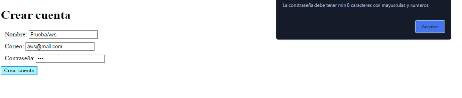

# Micro Servicios
Aplicativo para la publicación de tweets mediante un logeo basico, permite leer los twwets que se han publicado en un canal global y permite la creación de Usuarios dentro del aplicativo junto a seguridad mediante JWT para la conexión mediante API's


## Instalación del proyecto

### Prerequisites

- Maven - Administrador de dependencias y administrador del ciclo de vida del proyecto
- Java - Ambiente de desarrollo
- Git - Sistema de control de versiones y descarga del repositorio
- Docker - Sistema de control de contenedores

Descargue el repositorio con el siguiente comando

```
git clone https://github.com/ser0710/microservicios
```

Posterior a esto siga los siguientes pasos para instalar quarkus y poner a correr el prouecto


### Instalación de quarkus

#### code-with-quarkus

This project uses Quarkus, the Supersonic Subatomic Java Framework.

If you want to learn more about Quarkus, please visit its website: https://quarkus.io/ .

#### Running the application in dev mode

You can run your application in dev mode that enables live coding using:
```shell script
./mvnw compile quarkus:dev
```

> **_NOTE:_**  Quarkus now ships with a Dev UI, which is available in dev mode only at http://localhost:8080/q/dev/.

#### Packaging and running the application

The application can be packaged using:
```shell script
./mvnw package
```
It produces the `quarkus-run.jar` file in the `target/quarkus-app/` directory.
Be aware that it’s not an _über-jar_ as the dependencies are copied into the `target/quarkus-app/lib/` directory.

The application is now runnable using `java -jar target/quarkus-app/quarkus-run.jar`.

If you want to build an _über-jar_, execute the following command:
```shell script
./mvnw package -Dquarkus.package.type=uber-jar
```

The application, packaged as an _über-jar_, is now runnable using `java -jar target/*-runner.jar`.

#### Creating a native executable

You can create a native executable using: 
```shell script
./mvnw package -Pnative
```

Or, if you don't have GraalVM installed, you can run the native executable build in a container using: 
```shell script
./mvnw package -Pnative -Dquarkus.native.container-build=true
```

You can then execute your native executable with: `./target/code-with-quarkus-1.0.0-SNAPSHOT-runner`

If you want to learn more about building native executables, please consult https://quarkus.io/guides/maven-tooling.

#### Provided Code

#### RESTEasy Reactive

Easily start your Reactive RESTful Web Services

[Related guide section...](https://quarkus.io/guides/getting-started-reactive#reactive-jax-rs-resources)

## Descripción de la Arquitectura

El desarrollo del aplicativo se encuentra en diferentes instancias de AWS, 
en 2 instancias de EC2 se tiene las dos APIs de los microservicios corriendo,
en un bucket S3 se tienen los archivos estáticos donde podemos encontrar el HTML
y la conexión con las APIs. Finalmente, las APIS se comunican con una base de datos
no relacional de MongoDB.

## Reporte de pruebas
Formulario de Login para ingresar a la aplicación


Se ingresa con un usuario creado en la base de datos


Se ingresa al aplicativo donde se puede observar un campo para agregar un nuevo tweet y los tweets publicados antes


En las siguientes fotos se puede ver como se agrega un nuevo tweet


Se ingresa con un usuario incorrecto y nos sale esto




## Video del funcionamiento

## Construido con

* [Maven](https://maven.apache.org/) - Dependency Management

## Versonamiento

Versión 1.0

## Autores

- Daniel Esteban Ramos Jimenez
- Juan Diego Becerra Peña
- Sergio Andrés Rozo Pulido